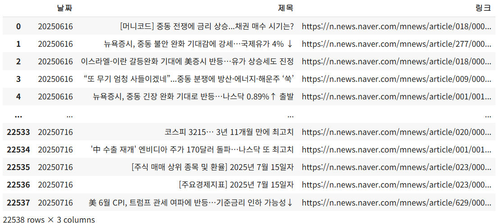
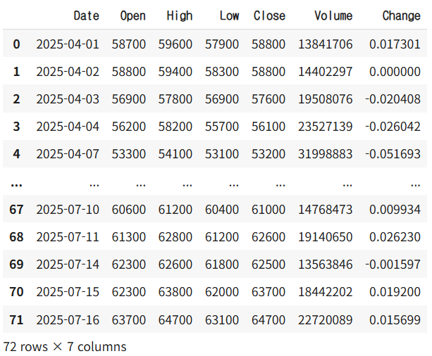

# ✨ 스마트 주식 분석 대시보드 ✨

### 당신의 현명한 투자를 위한 최고의 파트너

---

<h1 style='text-align: center; color: #2E86C1; font-size: 3em;'>환영합니다! 👋</h1>
<h3 style='text-align: center; color: #5D6D7E;'>기업 정보를 한눈에, 스마트하게 분석해보세요.</h3>
 

### 💡 주요 기능

- **📊 실시간 지수 확인**: 왼쪽 사이드바에서 코스피, 코스닥, 환율, 나스닥 등 주요 금융 지수를 실시간으로 확인하세요. 시장의 흐름을 놓치지 마세요!

- **📈 상세 주식 차트**: 입력하신 회사의 주가 흐름을 기간별 차트로 시각화하여 제공합니다. 추세 분석이 쉬워집니다.

- **📰 최신 뉴스 분석**: 해당 기업과 관련된 최신 뉴스를 수집하고 키워드를 분석하여 제공합니다. 시장의 반응을 빠르게 읽어보세요.

## 사용 데이터셋

- 네이버 증권 기사 크롤링 (22538rows, 2025.06.16~2025.07.16)
  

- FinanceDataReader 주식 데이터
  

## 세부 기능

- 당일의 KOSPI, KOSDAQ, 달러 환율, NASDAQ 지수 표시
- 공포탐욕지수(Fear & Greed Index) 표시
- 원하는 종목 검색
- 차트/보조지표 구현(MA,EMA,RSI,BB)
- 종목 뉴스 데이터 워드클라우드 조회(긍정/부정 키워드,비율)
- 뉴스 리스트 조회/이동

## 트러블슈팅

- 버튼 state가 한 개만 True로 되는 streamlit의 특징

  - 등록한 지표를 삭제하기 위해 다수의 버튼을 생성했다.
  - 버튼에 대해서 반복하여 몇번 인덱스(몇 번 지표)가 True인지 판단하였으나,... 안됐습니다
  - st.session_state에 지표에 대한 버튼 리스트를 추가하고, 각 버튼의 onclick 인자에 각 지표를 삭제하는 로직을 추가하여 해결했습니다.

- 기존 캔들 차트의 서브플롯 개수는 두개로 캔들을 위한 칸, 거래량을 위한 칸이었습니다.

  - RSI를 지표를 거래량 칸에 동시에 시각화 하였는데, 두 지표의 스케일 차이가 일반적으로 크다는 문제를 발견했습니다.
  - 따라서, 최초에 서브플롯을 생성할 때 세 개의 행을 만들어 세번째 행을 비워뒀습니다.
  - RSI 지표가 추가 되었을 때만 세번째 칸에 RSI 지표가 표시됩니다.

- 워드클라우드 생성 시 '해당 회사명' 키워드가 가장 많이 노출되는 문제를 수정하였습니다.

  - ex) '삼성전자', '삼성' 등 해당 회사명과 그룹명이 들어간 키워드 제외

- 배포 이후 일정 시간이 지나자 주식 데이터를 제대로 가져오지 못하는 오류가 발생하였습니다.
  - FinanceDataReader는 API가 아닌 웹크롤링 방식으로, 한국거래소(KRX)에서 외국 클라우드 아이피가 밴되는 것으로 추정
  - streamlit을 reboot하여 일시적으로 해결하였으나, 동일한 오류가 다시 발생하였습니다.

- 동일 파일을 수정하여 깃허브 커밋 시 충돌이 발생하였습니다.
  - 각자 맡은 파트에 따라 디렉토리 구분
  - 사이트 레이아웃 수정시 (app.py)를 공통적으로 수정하여 충돌 발생

## 역할

| 이름 | 담당 역할 |
| --- | --- |
| **이정환** | 기능 총괄, 차트 시각화 및 차트 페이지 구현 |
| **이소정** | 사이드바, 초기 페이지 구현 |
| **이민지** | 뉴스 데이터 후처리, 워드클라우드 생성 |
| **이계무** | 뉴스 데이터 크롤링, 주식 데이터 전처리 파이프라인 구성 |

  

## 출처 (클릭시 출처로 이동)
* <a href='https://github.com/FinanceData/FinanceDataReader'>[주식 정보 - FinanceDataReader]</a>
* <a href='https://news.naver.com/breakingnews/section/101/258'>[뉴스 크롤링 데이터 - 네이버 뉴스]</a>
* <a href='https://github.com/zzaebok/ksenticnet/tree/master'>[한국어 감성 사전]</a>
* <a href='https://github.com/vterron/fear-and-greed?tab=readme-ov-file'>[ 공포 탐욕 지수]</a>
